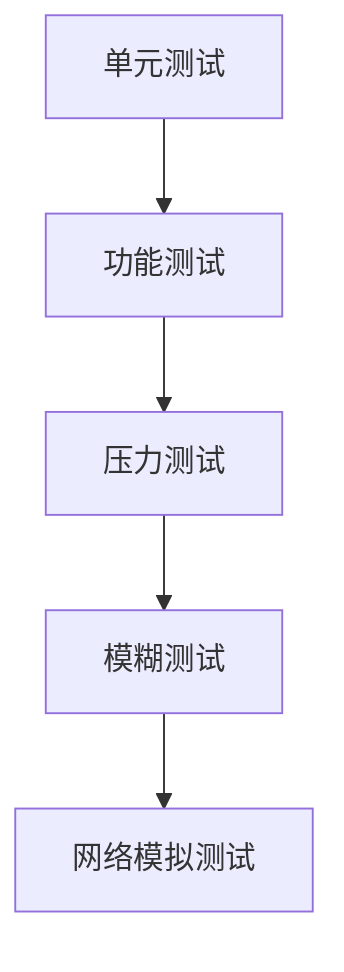

# Bitcoin Core 开发流程简介

Bitcoin Core 作为比特币协议的核心实现，其开发流程以严谨性和社区协作著称。本文将系统梳理参与 Bitcoin Core 贡献的技术路径与社区规范，帮助开发者建立清晰的认知框架。

## 为什么选择参与 Bitcoin Core 开发？

### 精英化治理体系的机遇与挑战
Bitcoin Core 采用技术精英治理模式，这种机制既保障了代码质量，也为贡献者提供了公平竞争的舞台。无论开发者来自何种背景，代码质量始终是唯一评判标准。这种去中心化的评审机制催生了独特的成长路径：
- **去中心化权威**：Pieter Wuille 等核心贡献者的地位源于多年高质量输出
- **渐进式成长**：从修复简单 bug 到参与共识层开发需要 3-5 年积累
- **复合能力要求**：需同时掌握 C++/Python 编程、密码学基础、分布式系统知识

### 开发者能力矩阵
成功的 Bitcoin Core 开发者需具备三维能力模型：
| 维度        | 能力要求                  | 典型表现                  |
|-------------|---------------------------|---------------------------|
| 技术深度    | 精通零拷贝网络编程        | 能优化 P2P 协议性能瓶颈   |
| 工程规范    | 熟悉 CI/CD 自动化流程     | 确保 PR 通过全部测试用例  |
| 社区协作    | 掌握 RFC 提案撰写技巧     | 能推动 BIP 草案社区共识   |

## 开发环境搭建指南

### 技术栈准备
核心开发工具链配置要点：
```bash
# Git 配置示例
git config --global user.name "YourName"
git config --global user.email "email@example.com"
git clone git@github.com:bitcoin/bitcoin.git

# 依赖安装（Ubuntu 22.04）
sudo apt-get install build-essential libtool autotools-dev automake pkg-config bsdmainutils python3
```

### 跨平台编译要点
不同操作系统的关键配置差异：

| 平台       | 特殊配置项              | 常见问题解决方案          |
|------------|-------------------------|---------------------------|
| Linux      | ZMQ 支持配置            | 安装 libzmq3-dev          |
| macOS      | Homebrew 依赖管理       | 使用 wxPython 替代方案    |
| Windows    | Mingw-w64 编译器链      | 配置交叉编译环境变量      |

## 贡献流程全解析

### PR 生命周期管理
标准化的代码贡献流程：
1. **问题定位**：通过 GitHub Issues 跟踪系统选择合适任务
2. **分支管理**：基于最新 master 创建特性分支
   ```bash
   git checkout -b feature-branch master
   ```
3. **代码提交**：遵循提交规范（Commit Style Guide）
4. **测试覆盖**：确保单元测试通过率 100%
5. **评审迭代**：响应 reviewer 意见平均 3-5 轮次

### 代码评审黄金法则
有效的评审策略矩阵：
| 评审维度   | 检查要点                  | 典型问题示例              |
|------------|---------------------------|---------------------------|
| 功能验证   | 是否实现预期功能          | 交易验证逻辑漏洞          |
| 安全审计   | 内存管理是否合规          | 缓冲区溢出风险            |
| 性能评估   | 是否引入性能瓶颈          | 数据库查询优化不足        |
| 可维护性   | 代码注释是否完整          | 关键算法缺乏解释          |

## FAQ 常见问题解答

### Q1: 新手应如何选择第一个贡献任务？
建议从文档完善或测试用例补充开始：
- 修复 README 中的格式问题
- 为未覆盖模块编写单元测试
- 本地化翻译技术文档

### Q2: PR 被拒绝后该如何处理？
遵循三步优化法：
1. 仔细分析 reviewer 意见
2. 在 IRC 频道进行技术讨论
3. 按照反馈迭代修改后重新提交

### Q3: 如何高效参与代码评审？
掌握评审方法论：
- 每日投入 2 小时进行代码阅读
- 优先评审与自己专长相关的 PR
- 使用 GitHub 的批注功能进行结构化反馈

### Q4: 测试环境搭建遇到问题怎么办？
推荐排查流程：
1. 查阅官方构建文档
2. 搜索 Bitcoin StackExchange 同类问题
3. 在 Slack 的 #builds 频道寻求帮助

## 开发者成长路线图

### 能力进阶阶段
1. **入门阶段（0-6 个月）**
   - 完成 5 个文档类 PR
   - 参与 10 次代码评审
2. **进阶阶段（6-18 个月）**
   - 主导中等复杂度功能开发
   - 成为特定模块维护者
3. **专家阶段（18+ 个月）**
   - 参与共识层协议设计
   - 担任核心代码库合入维护者

### 质量保障体系
Bitcoin Core 的多重测试机制：


## 持续贡献策略

### 时间管理建议
成熟开发者的工作模式：
- 每日 1 小时：阅读邮件列表和 GitHub 通知
- 每周 5 小时：深度评审 2-3 个关键 PR
- 每月 1 次：参与核心开发者视频会议

### 社区协作技巧
有效的沟通准则：
1. 在 IRC 讨论时提供具体上下文
2. 提交 PR 时附带详细技术文档
3. 对争议性提案采用 RFC 文档形式讨论

👉 [深入了解区块链开发资源](https://bit.ly/okx_welcome)

## 结语

Bitcoin Core 的开发实践体现了开源社区的极致工程追求。从代码风格到测试覆盖率，从评审流程到社区协作，每个环节都渗透着对可靠性的执着。这种严苛的标准既是技术保障，也是能力试金石。对于有志于区块链底层技术的开发者而言，持续参与 Core 项目既是挑战，更是通向技术巅峰的必经之路。