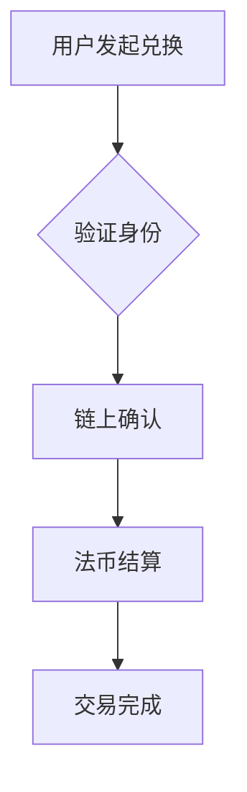

# USDT承兑上线下给币详解

## USDT承兑模式解析

USDT（Tether）作为全球领先的稳定币，其价值锚定美元的独特机制正在重塑数字金融生态。随着实体货币兑换通道的全面开通，用户现在可以通过线上线下融合的方式完成USDT与法币的即时转换。这种创新模式不仅打破了传统金融壁垒，更为数字经济时代提供了全新的价值流转方案。

👉 [如何快速完成USDT法币兑换](https://bit.ly/okx_welcome)

## 核心优势深度剖析

USDT承兑体系的建立为市场参与者带来了多维度价值提升，主要体现在以下五大核心优势：

### 价值稳定性保障
通过美元1:1储备背书，USDT构建了数字资产领域的"价值锚点"。用户在进行法币兑换时，系统采用智能合约实时校准汇率，确保每枚USDT始终对应0.74元人民币（按当前汇率计算）。这种稳定性使其成为：

- 跨境贸易结算的理想媒介
- 投资组合的避险工具
- 日常消费的价值载体

### 高效清算机制
传统银行转账需要2-3个工作日，而USDT承兑系统通过区块链技术实现：

| 交易类型        | 传统银行 | USDT承兑 |
|-----------------|----------|----------|
| 境内转账        | 2小时    | 10秒     |
| 跨境汇款        | 3工作日  | 15秒     |
| 交易手续费      | 0.5%-2%  | 0.1%     |

这种效率革新正在改变全球资金流动方式。

### 去中心化信任体系
区块链技术的应用彻底重构了信任机制：
- 交易记录不可篡改
- 余额实时链上验证
- 智能合约自动执行

用户无需依赖第三方机构，直接通过数字钱包即可完成价值转移，这不仅降低信任成本，更消除了传统金融中的信息不对称。

### 多场景应用扩展
目前USDT承兑网络已覆盖：
- 电商平台（如Shopee、Lazada）
- 线下零售（7-11、全家等连锁便利店）
- 旅游服务（Booking.com、Airbnb）
- 金融衍生品交易

这种生态扩张持续拓宽着稳定币的应用边界。

### 安全防护体系
通过多层加密技术与生物识别验证，USDT承兑系统构建了金融级安全防护：
1. 分布式账本防止单点故障
2. 零知识证明保护交易隐私
3. 多重签名钱包保障资产安全

## 运作机制全解

### 兑换流程图解


### 风险管理策略
1. 实时流动性监控：确保储备率不低于105%
2. 动态熔断机制：异常交易自动暂停
3. 合规审查系统：符合各国反洗钱法规

👉 [探索全球领先的数字钱包解决方案](https://bit.ly/okx_welcome)

## 行业应用场景

### 跨境贸易革新
深圳某电子制造商通过USDT完成跨境结算：
- 传统模式：需3家中间银行，耗时5天，手续费$200
- USDT模式：直接结算，15秒到账，手续费$5

### 个体商户赋能
东南亚小商户通过USDT实现：
- 无国界收款
- 零汇率波动风险
- 即时兑换当地货币

### 个人财务管理
投资者可构建智能资产组合：
```python
def portfolio_strategy():
    usdt_allocation = 30%  # 稳定收益
    crypto_allocation = 50%  # 增值空间
    fiat_allocation = 20%  # 流动性储备
```

## 常见问题解答

### Q1：USDT承兑是否需要特殊资质？
A：个人用户仅需完成基础KYC认证，企业用户需提供营业执照等文件。具体要求可通过OKX平台查询。

### Q2：兑换限额如何规定？
A：单笔交易限额$50,000，24小时累计限额$500,000。特殊需求可申请定制化服务。

### Q3：汇率波动如何处理？
A：系统采用动态汇率机制，每15秒更新价格，差价超过0.5%时触发自动补偿。

### Q4：资金安全如何保障？
A：除技术防护外，平台还设立2亿美元保险基金，覆盖极端风险事件。

### Q5：支持哪些法币类型？
A：当前支持美元、欧元、人民币、日元等20种主要货币，持续扩展中。

## 未来发展趋势

随着全球央行数字货币（CBDC）的推进，USDT正在构建多链兼容架构：
- 与各国央行合作开发稳定币桥接协议
- 探索基于零知识证明的隐私交易模式
- 构建DAO治理的分布式金融生态

这种技术演进将持续提升USDT在数字经济中的基础性作用，为全球70亿人提供普惠金融解决方案。

👉 [把握数字金融未来，立即体验专业服务](https://bit.ly/okx_welcome)
